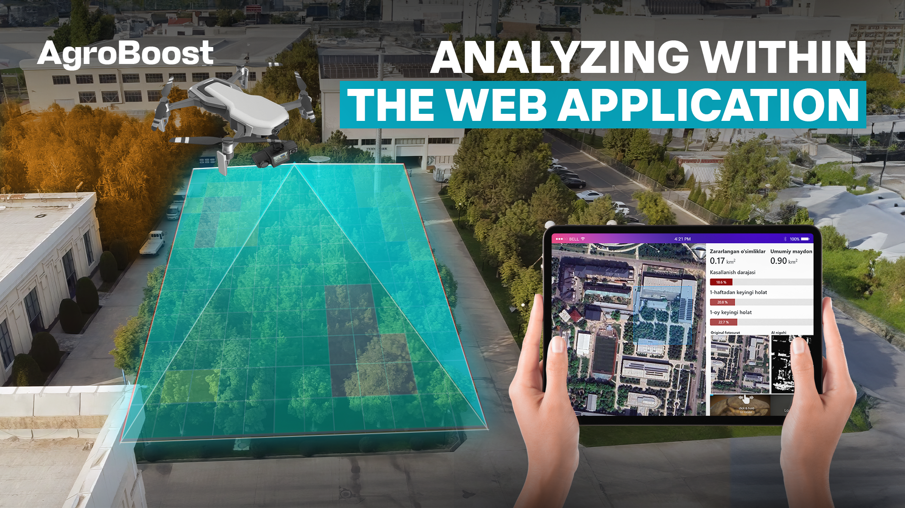

# AgroBoost



AgroBoost is an innovative solution designed to enhance agricultural productivity through advanced analytics and
automation. It leverages cutting-edge technologies to provide farmers with actionable insights, optimize resource
utilization, and increase crop yields.

## Criteria checklist
### Code Quality
- **Technologies:** Python, Vue.js
- **Frameworks:** Django for backend, FastAPI for APIs, MinIO for object storage
- **Best Practices:** Adheres to modular programming, separation of concerns, clear folder structures, and Docker Compose for consistent environment setup. While the project exhibits clean code, further improvements could include comprehensive testing (unit and integration) and thorough documentation to enhance maintainability and collaboration.


### Performance & Efficiency

-	**Optimizations:** Docker-based containerization ensures efficient resource usage. FastAPI enhances API performance due to its asynchronous nature. The drone captures images at 1 frame per second, ensuring resource-efficient data acquisition. MinIO for object storage ensures optimized file management, and asynchronous API operations minimize latency during large-scale data transfers.
-	**Areas for Improvement:** Profiling for specific bottlenecks in image processing could yield further optimizations.

### Scalability
-	**Infrastructure:** The project leverages Docker Compose, enabling easy scaling of services across multiple containers. MinIO provides scalable object storage, while FastAPI ensures efficient handling of a large number of API requests. These components, combined with a modular architecture, allow for the system to scale horizontally with minimal refactoring.
-	**Future Enhancements:** Introduction of load balancing, distributed processing (e.g., using Kubernetes), and optimized database management can improve scalability further as the project grows in complexity and usage.

### Architecture & Code Design
- The project architecture is [here](https://miro.com/app/board/uXjVLcIyaoo=/?share_link_id=287040409386).
-	**Design Patterns:** The project follows the MVC pattern, separating concerns between models, views, and controllers. The use of FastAPI for APIs ensures a clean separation between the frontend and backend, enhancing modularity and maintainability.
-	**Code Design:** The codebase is well-structured, with clear folder organization and modular components. The use of Django and FastAPI allows for easy extension and modification of features. However, further documentation and comments could enhance code readability and maintainability.

### Documentation
- Documentation is available in the [docs](docs) folder.


## Table of Contents

- [Features](#features)
- [Demo](#demo)
- [Installation](#installation)
    - [Prerequisites](#prerequisites)
    - [Setup](#setup)
- [Usage](#usage)
- [Roadmap](#roadmap)
- [Team members](#team-members)

## Features

- **Predictive Analytics:** Utilize machine learning models to forecast crop yields and pest infestations.
- **Data Visualization:** Interactive dashboards for visualizing agricultural data trends.
- **User-Friendly Interface:** An intuitive web application that makes data accessible for all users.
- **Customizable Reports:** Generate tailored reports to meet specific agricultural needs.

## Demo

[](https://www.youtube.com/watch?v=p3eykX59K-4)

*Click the image above to watch the demo video.*

## Installation

### Prerequisites

- Python 3.9 or higher
- pip package manager
- Docker and Docker Compose
- Git

### Setup

1. Clone the repository

`   
    git clone https://github.com/your_username/AgroBoost.git
`

2. Navigate to the project directory

`   cd AgroBoost
`

3. Create a virtual environment

```   
   python -m venv venv
   source venv/bin/activate  # On Windows use `venv\Scripts\activate`
```

4. Install the required packages

`pip install -r requirements.txt`

## Usage

1. Configure the application settings.

2. Run the application

   `docker-compose up -d --build`

3. Access the dashboard

   Open your web browser and navigate to http://localhost:8080.

## Roadmap

- [x] Implement real-time data monitoring
- [x] Integrate machine learning models
- [x] Expand support for IoT devices
- [ ] Develop mobile application

## Team members

- [Bekhruz Nutfilloev]()
- [Amirbek Aslonov]()
- [Humoyun Ochilov]()
- [Iskandar Hamroyev]()